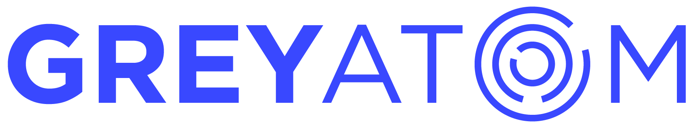

  

# Getting Started with Frontend Engineering

Congratulations on taking the first step towards learning Frontend Engineering. We have curated a learning path for you to get started. The path is divided into two sections: Foundations of Web Development and Basics of Data Structures and Algorithms. Start your learning journey with these resources. 

Before you begin, here is a must-read article on [Things to Know before you begin programming](https://medium.com/better-programming/30-short-things-i-wish-i-knew-all-this-when-i-started-programming-b17667e3df0c). Also understand in detail the [learning journey you will take in your frontend upskilling](https://www.thinkful.com/blog/why-learning-to-code-is-so-damn-hard/)

## Foundations of Web Development

### HTML and CSS

Start off learning HTML and CSS with the excellent tutorial on [Interneting is Hard](https://internetingishard.com/html-and-css/). (The title is deceptive but a really easy tutorial). 

Get hands-on learning through the excellent courses on HTML and CSS in Sololearn. 
- [HTML Basics](https://www.sololearn.com/Course/HTML/)
- [CSS Basics](https://www.sololearn.com/Course/CSS/)

### JavaScript

A very good introductory course on Javascript to get started on.
- [Introduction to JavaScript by CodeAcademy](https://www.codecademy.com/learn/introduction-to-javascript)

After the introductory courses are done, go ahead and learn responsive web design on [Free CodeCamp](https://www.freecodecamp.org/learn).

## Data Structures and Algorithms

### Learning Basic Data Structures and Algorithms

Brush up your basics in data structures and algorithms by going through these fantastic YouTube playlists. 

- [Coding Dojo's DS&A Playlist](https://www.youtube.com/watch?v=UNWSdgaPkwY&list=PLBZBJbE_rGRV8D7XZ08LK6z-4zPoWzu5H&index=8)
- [MyCodeSchool's YouTube Playlist](https://www.youtube.com/watch?v=92S4zgXN17o&list=PL2_aWCzGMAwI3W_JlcBbtYTwiQSsOTa6P)

### 30 days of coding

Take the [Hackerrank's 30 days of coding](https://www.hackerrank.com/domains/tutorials/30-days-of-code) and unlock your prowess. 

## Additional Resources 

In addition to the above resources, you can brush up your aptitude skills by attempting the questions on [Indiabix](https://www.indiabix.com/). Good communication is always an important skill to have. Sharpen your english communication skills by downloading the awesome apps like [Duolingo](https://www.duolingo.com/) and [Memrise](https://www.memrise.com/). 

## GreyAtom's Philosophy on Learning

### Learning is for everyone.
We've all got plenty of neuroplasticity left in us! No matter your background, you can learn what you want to learn. Believe that you can, and believe that those around you can too.

### Learning is a consequence of thinking.
Reading is one way of getting you to think about things that you wouldn't otherwise. Writing encourages thinking. Discussion encourages thinking. Being active encourages thinking. Do things! Try things! Think about things!

### We are all students. We are all teachers.
There's so much to know! We all learn from one another. Embrace opportunities to learn from others, and opportunities to share what you know.

### Communicate early and often.
We want to know what you're thinking. Stay connected with us by joining the [**GreyAtom Learning Community**](https://join.slack.com/t/greyatom-frontend/shared_invite/enQtNzk4MDAzNjExNzI5LWJjN2Y1NThiMjZmMDIyMDg5MGNmYjhmZDg3ODdjOWZkODRlODQwZGFiNjc5MGYwYzBkNTI0NjM1NWI1M2UyMzI) (click to join) and get help from your peers when stuck. 

Join our [Datagiri Meetup community](https://www.meetup.com/datagiri/) and continue learning through the free online webinars. 
 
